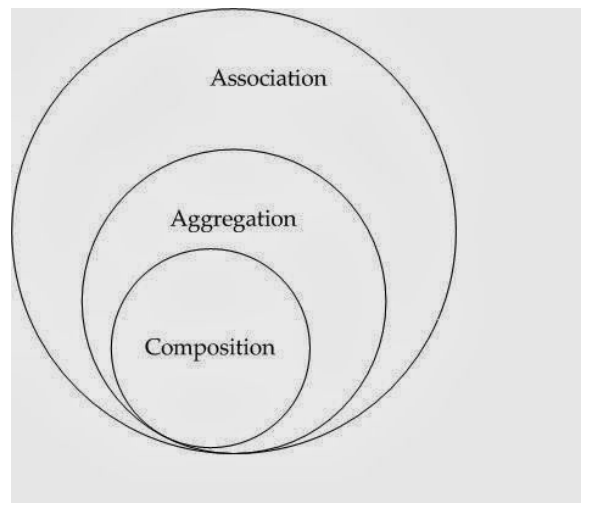

# Design Principles:
Software design principles are a set of guidelines that helps developers to make a good system design. The most important principle is SOLID principle

## Dependencies

### 1. Association:
   - All objects has their own lifecyclqe
   - This is represented by a solid line
 

#### Example
            Example of a relationship between Teacher and Student. Multiple students can associate with a single teacher
            and a single student can associate with multiple teachers. But there is no ownership between the objects and
            both have their own lifecycle. Both can be created and deleted independently.

### 2. Aggregation: 
  - It is a specialized form of Association where all object has its own lifecycle but there is ownership.
  - This represents “whole-part or a-part-of” relationship. 
  - This is represented by a hollow diamond followed by a line.

#### Example
        Let’s take an example of a relationship between the Department and Teacher. A Teacher may belong to multiple departments.
        Hence Teacher is a part of multiple departments. But if we delete a Department, Teacher Object will not destroy.
 

### 3. Composition: 
   - It is a strong type of Aggregation. 
   - In this relationship, child objects do not have their lifecycle without the Parent object. If a parent object is deleted, all its child objects will also be deleted.
   -  This is represented by a solid diamond followed by a line.
  
  
  #### Example

            Let’s take an example of a relationship between House and rooms. House can contain multiple rooms
            there is no independent life of room and any room cannot belongs to two different houses if we delete the house room
            will automatically delete.

## Symptoms of Rotting Design :

### 1. Rigidity:
* when nearly every change made to the code causes a cascade of subsequent necessary changes for dependent modules
* This code can be very difficult to maintain as seemingly simple tasks spiral into huge projects because of unknown dependencies buried in multiple places.

### 2. Fragility:
* is a close relative to Rigidity
* symptom here is the breakage of code in multiple locations when changes are made
* Problems may arise in fragile code in areas that have no conceptual relationship to the code that has been updated

### 3. Immobility: 
* the inability to reuse code in other parts of your project because the code in question has too much baggage
* the time it would take to clean up the code outweighs the time it would take to build it from the ground up.

### 4. Viscosity: 
* There is two types of Viscosity 
    1. Viscosity of the design: When the design preserving methods are harder to employ than the hacks
    2. Viscosity of the environment: when the development environment is slow and inefficient

## SOLID Principles:

### 1. Single Responsibility Principle (SRP):
* This principle states that there should never be more than one reason for a class to change
* You should design your classes in such a way that each class should have a single purpose.
#### Example:
        An Account class is responsible for managing Current and Saving Account but a CurrentAccount and a SavingAccount classes
        would be responsible for managing current and saving accounts respectively. Hence both are responsible for single purpose only.
        Hence we are moving towards specialization.

## 2. Open/Closed Principle (OCP):
* software entities (classes, modules, functions, etc.) should be open for extension but closed for modification
* The "closed" part of the rule states that once a module has been developed and tested, the code should only be changed to correct bugs.
* The "open" part says that you should be able to extend existing code in order to introduce new functionality.
#### Example
        A PaymentGateway base class contains all basic payment related properties and methods. This class can be extended by
        different PaymentGateway classes for different payment gateway vendors to achieve theirs functionalities.
        Hence it is open for extension but closed for modification.

## 3. Liscov Substitution Principle (LSP):
* New derived classes are extending the base classes without changing their behavior
#### Example
        Assume that you have an inheritance hierarchy with Person and Student. Wherever you can use Person,
        you should also be able to use a Student, because Student is a subclass of Person.

## 4. Interface Segregation Principle (ISP):
* Clients should not be forced to depend upon interfaces that they don’t use.
#### Example 
        The service interface that is exposed to the client should contains only client related methods not all.

## 5. Dependency Inversion Principle (DIP):
* High level modules should not depend upon low level modules. Both should depend upon abstractions.
* Abstractions should not depend upon details. Details should depend upon abstractions.
  #### Example 
        if we have a high level module which is (Driver) and Low Level Module Which is (Car)
        both Should Depend on Abstract Class Called (Vehicle).        
        Now if both classes depend on abstract vehicle class then the Driver Can drive Bus not only Cars
 

## Other Principles:
* **Don't Repeat your self (DRY)**
  * This principle states that each small pieces of knowledge (code) may only occur exactly once in the entire system. 
  * This helps us to write scalable, maintainable and reusable code.
* **Keep it simple, Stupid!(KISS)**
  * This principle states that try to keep each small piece of software simple and unnecessary complexity should be avoided.
  * This helps us to write easy maintainable code.
* **You ain't gonna need it (YAGNI)**
  * This principle states that always implement things when you actually need them never implements things before you need them.
* The Law of Demeter (LoD)
  * also called principle of least knowledge
  * Each unit should have only limited knowledge about other unit
* Encapsulating what varies
  *  technique that helps us handle frequently changing details
  *   Code tends to get tangled when it is continuously modified due to new features or requirements
  *   By isolating the parts which are prone to change we limit the surface area that will be affected by a shift in requirements
* Favor Composition over Inheritance
  * The fact that Java does not support multiple inheritances is one reason for favoring composition over inheritance in Java.
  * In object-oriented programming, the composition is the architecture strategy for executing a relationship between objects. Java composition is done using instance variables from other objects. 

# Refrences: 
- [Dependencies](https://www.dotnettricks.com/learn/designpatterns/different-types-of-software-design-principles)
- [SOLID Principles](https://medium.com/@trionamoynihan/solid-design-principles-eec367b2b8)
- [Other Principles](https://en.wikipedia.org/wiki/Law_of_Demeter)

